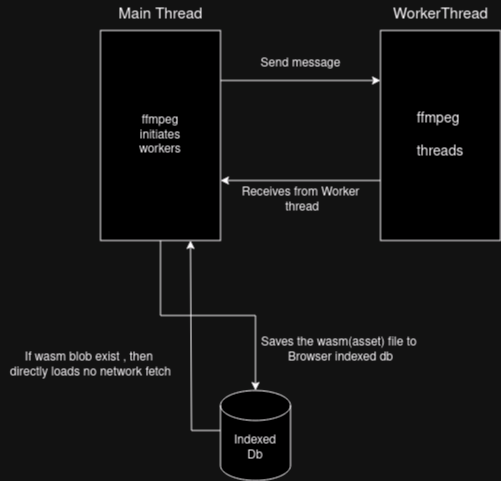

# Vwa

Playable demo of video and Audio stream extractor using ffmpeg.wasm.

## Features

- Saving wasm file locally(no need to fetch again if page reloads)
- Can able to download
- Extract Video and Audio stream separately

## Architecture


## Local Development
``` bash
npm install
npm run execute
```

## Resources
- [Indexed Db](https://developer.mozilla.org/en-US/docs/Web/API/IndexedDB_API/Using_IndexedDB)
- [Blob](https://developer.mozilla.org/en-US/docs/Web/API/Blob)
- [FFmpeg](https://ffmpeg.org/ffmpeg.html)
- [FFmpeg wasm](https://github.com/ffmpegwasm/ffmpeg.wasm)


